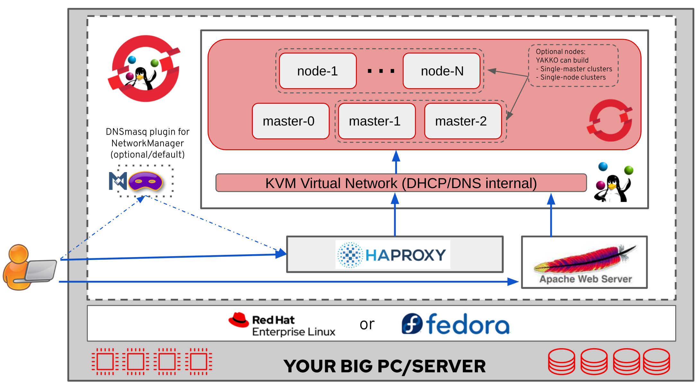

# YAKKO
## [Y]et [A]nother [K]VM [K]onfigurator for [O]penShift 

## WHAT IS YAKKO?
**The Short Explanation:** YAKKO installs OpenShift on your server running RHEL/Fedora.  

**The Long Explanation:** YAKKO is an "IPI-like" installer for Red Hat OpenShift (IPI = Installer Provisioned Infrastructure). What this means is that the installer also provisions everything! In this case, "everything" sits in one system, which is why there is no Red Hat provided installer for this non-enterpise situation. So, if you want to run up an OpenShift cluster with multiple nodes or why not, a Single Node Cluster ("SNO") and you have a big PC/small server with RHEL or Fedora, then YAKKO might be for you. 

There are plenty of cookbooks out there and they require that you do a lot of *manual* work. **YAKKO avoids it!** If you are a Linux tinkerer with a penchant for the command line and all things Red Hat/Fedora, YAKKO might just be that new friend you were looking for to play with Kubernetes.

---

## CURRENT VERSION: 9.02 (20250822.1707)
- Named it 9.0 because there is no guarantee it can be replaced in-place!
- Tested on RHEL 9.6, RHEL 10 and Fedora 42
- Tested with OpenShift 4.18 and 4.19 (seems to work all the way to 4.2!)
- Looking much more refined!
- Revamped snapshots, you can take snapshots with active and inactive clusters, so not experimental anymore!
- Added 'startonboot' to 'infra' options - which will enable start-up of the cluster on system boot
- Updated SNO build process as a new stringent check came into place with 4.18.17
  All single master clusters (SNO or one master + many workers now build with bootrstrap in place)
- Improved the 'yakko ops emergency' feature - added a "reboot node" option
- Added system info to the regular yakko report (system temperature and RAM available)
- Added GPU report on 'yakko infra describehw'
- General code improvement and cleanup:
    - Eliminated code for building clusters using the agent based installer (sorry)
    - Eliminated code that would have allowed Mirrored installs (was never used)
    - Deleted unused code blocks that had been commented out over time
- A few bugs cleaned up here and there, right?

**Some of the cool features that have been there a for a while**
- Eliminate the dependency on your physical network by isolating access just to the system that YAKKO is built upon (by using yakko infra changeaccess)
- Adapt to changes in the IP address of the server (e.g. when changing wireless networks!)
- Support for single node/single master clusters (SNOs) since OpenShift 4.10
- Support for installing multiple clusters (but run one at a time!)
- Support for resizing (master/worker) node RAM - on the go!
- Setting up NFS shares for registry and for Namespace/Project storage on your server
- Assigning NFS shares for registry and for Namespace/Project storage 
- Purging existing downloaded OpenShift images on disk
- List services and files that are in use by a cluster
- Running post-install tasks

**What else is in the works?**
- Evaluating 'cloning' a cluster to another directory/disk. Two purposes, making a working copy of a working cluster and possibly transporting a cluster to another system

**Cool facts**
- YAKKO has built more than 1000 clusters just in testing
- The fastest build was 21 minutes - but that was in the days of fewer operators. This was on a 4-core PC...
- On a well spec'd laptop, a 3+2 OCP 4.19 cluster can take under 31 minutes. Interestingly, SNOs using bootstrap in place can take about as long...
- It is 7,000+ lines of code - but that makes it simple and portable. The build part is likely less than 5,000 lines
- To this day, it can build clusters all the way back to OpenShift 4.2, though you may want to enable the local registry for that (4.1 was only supported on AWS.)
- Resource allowing, it has run up a 3 master, 10 worker cluster!

---
## INTRODUCTION
YAKKO was built around the concept of having ONE script/installer/manager that does it all, using the underlying operating system as the installation/operating platform and resource server/service. As a prime example, YAKKO depends on libvirt/KVM and so it will install and configure required packages on your server to build and run OpenShift VMs, just as it may be used as the DNS resource should you not have your own DNS. Because of this, YAKKO is a bit opinionated, but then again, it's not built for creating "production ready" clusters, and so it should suit most people with a passing need or interest in having an OpenShift cluster around (or... again!)

Why would you want to run your own (single-box) cluster, isn't that self defeating because there is no real resilience?
- A full cluster at your disposal lets you test full cluster functionality
- You can experiment with multiple node setups in an easy self-hosted lab fashion
- You can easily setup different versions of OpenShift and examine features and compare behaviour 
- No public cloud bill... or bill shock! 
- You can test your more complex apps on multiple worker nodes 'for real' 
- You might be a fan of "self hosting"
- OpenShift Pull Secrets from Red Hat have a lifetime of 60 days, so re-installing is kinda useful
- You can mess with different clusters on the same server (BUT NOTE! Only one cluster running at a time!)
- You can create cheap clusters for experimenting with Red Hat Advanced Cluster Manager (RHACM)
- LEARN without fear or/of consequences!

In a nutshell, what does YAKKO do? 
- Sets up and installs any and all requirements/dependencies for you
- Installs OpenShift in a configuration of your choice:
  - Single-node Cluster aka SNO
  - Single-master cluster (with multiple workers)
  - 3-master cluster ("compact cluster) with no worker nodes
  - 3-masters + N-Workers (full blown HA clusters)
  - Add worker nodes, on initial build or later
- Builds automatically or in stages
- Leverages the host as bastion / HAProxy / DNS / image/storage server 
- Simplifies the networking by using a KVM network behind NAT 
- Rolls back individual failed stages so that you can fix if necessary and then keep going or just delete everything you've done so far and start afresh. 
  (Be careful - It's scary how quickly it does away with a happily running cluster!)
- Adds and destroys worker and infra nodes easily to suit your use case 
- Lets you create additional clusters (not just one, BUT you can only run one at a time)
- Overlays basic operational stuff - once you have the cluster up, it will hint you, using 'yakko [infra | ops]'
- Deletes the entire operational cluster you've built, and unconfigure all the above 
- But don't worry - you can build again right? Automatically... (try 'yakko rebuildcluster' for this!) 
- All of this very tidily - if you stop (or delete) a cluster, it will retire all associated system services files
- It is directory centric: each cluster resides in a different directory and perhaps different versions of YAKKO from other directories/clusters. Best practice is to always go to the directory of the cluster you want and run it from there.

---
## WHAT YAKKO IS NOT
It is not a management tool for OpenShift. It has a small overlay of features to assist in the "automation" of getting things done that may otherwise be repetitive, but once your cluster is up, you can delete YAKKO for all you know, however, since it can do a few things post install (see "Day 2 Ops)" as well as allow you to delete all VMs and the configuration in your system, you should keep it.

---
## REQUIREMENTS
**A single PC/server with:**
- Access to the internet
- RHEL/Fedora as the base installed operating system ("Server with GUI" is convenient, and then YAKKO gives you a working cluster)
- Ports 80 and 443 available (to pass through to your applications in OpenShift)
- 24GB+ RAM for a single node cluster (good luck though and note that your ability to run apps will be impaired, recommended is 32GB.
- 32GB+ RAM for a 1 master + 1 worker cluster
- 48GB+ for multi-node clusters (3 master compact cluster)
- 64GB+ for full-HA clusters (3 masters, 2 workers - more than 2 and you may need more memory)
- 2.5GB of disk space for the install files (YAKKO will accumulate older OpenShift versions so keep an eye on the "images" directory within the directory where it resides)
- SSD class storage with capacity as follows:
    - 3 masters require 120GB EACH
    - worker nodes require additional 120GB each
    - you can tweak the disk sizes if you must - edit YAKKO and look for MASTERDISKSIZE and WORKERDISKSIZE OR use a template (see 'yakko buildfromtemplate')
    - the above are the published requirements, in reality ~80GB per node should be sufficient
- For older versions of OpenShift, YAKKO will not adjust these values down. They are in tune with the latest version unless you change them or use a template

**Nice to Haves**
- Linux skills - if you are even attempting at using this, you must have some already...
- Project Cockpit is a good (though hungry) friend
- Although YAKKO adds a dnsmasq facility, having your own DNS server that can handle wildcards can be useful for other systems in your lab. If you have this and your clsuter doesn't leave the network, you can always answer 'N' to 'Use YAKKO's DNS service or set USEYAKKODNSMASQ=N in a template

**What's the test bed?**  
YAKKO is built on an Alienware Aurora R6 with an Intel i7-7700 (4c/8t @ 3.6GHz, ~2017) w/64GB RAM and one m.2 512GB SSD. For fun, the largest cluster I have built on it had 6 worker nodes. This machine has seen the build of more than 450 OpenShift clusters with YAKKO! (Is there a Guinness World Record for this?)
The RHEL 9 dev system is a Lenovo Thinkpad P1 Gen-3 with 64GB RAM and 8c/16t Intel i9. 
The newer testing system? Courtesy of Red Hat (my employer) a Lenovo P16 Gen-2 with 24 cores and 192 GB RAM (received in May 2025). One of the first test clusters in this system was a 3+10, so 13 nodes in total. a 3+2 takes about 30 minutes here! 25 clusters and counting already.
No, I have never used spinning disk, if you do, I wish you luck.

**How do I test quickly?**
You'find that YAKKO let's you build clusters in many ways:
This is an excerpt from calling 'yakko help':
```
When NO CLUSTER is configured you can call: 
    yakko  (no params) -------------------------> build new cluster - just answer questions
    yakko rebuildcluster -----------------------> recreate the last cluster built
    yakko buildclusterfromtemplate <file/URL> --> build new cluster from file or URL
    yakko buildclusterfromdefaults <#M> <#W> ---> build with all defaults, specifing only
                                                  # of masters and # of workers
```

---
## HOW TO - INSTALL or "DAY 1"
#### ➜ [Watch YAKKO 8.0 build a 3m+2w Cluster](https://asciinema.org/a/bMdXbL8o4DLCJUFLAjAo9RvMW)
#### ➜ [Watch (an earlier vesion of) YAKKO in action building OpenShift (video with voiceover)](https://youtu.be/hLsUp7dwxdQ)
#### STEPS
1) Get the 'yakko' script: 
   - You can clone the repo (ideally on /) OR  
   - download it from https://github.com/ozchamo/YAKKO/raw/master/yakko  
2) Run 'yakko' as root (always!) - e.g. `[root@ocphost]# ~/Downloads/yakko`
3) Choose a destination home directory for YAKKO - **usually /YAKKO** - you will be asked to re-run from there. 
4) After install, quite typically you will:
   - cd /YAKKO   # (if this is where you installed it)
   - ./yakko     # (to run it from the directory you're in. Surely you knew this ;)
4) 'yakko' will start the OpenShift install process when there is no cluster defined, so no further parameters are necessary
5) Follow instructions, my suggestion is that you run it manually until you get the hang of it
6) Once you get the flow, it can build a cluster AUTOMATICALLY. I've built many in one week
7) Depending on your hardware and desired cluster size you can have a cluster up and running in 30-50 minutes
8) Until there is no operational cluster, YAKKO will keep asking you to continue the install from where you left off
9) Once a cluster is operational, YAKKO reports something like this, anytime you run it without parameters:

```
__________________________________________________________________________

 YAKKO: Yet Another KVM Konfigurator for Openshift (Ver. 8.00)
__________________________________________________________________________

 CLUSTER: rectest.home  (Built: 13-Jun-2024@22:41:36)
 YAKKOID: 9848
 VERSION: 4.15.17
 @REDHAT: https://console.redhat.com/openshift/details/3c45c15e-1e0e-4e0a-a080-9dcb1daeaa41
 SUBNET:  192.168.141.0
 CERTEXP: Fri 14 Jun 2024 21:54:25 AEST
 PURPOSE: This cluster is being built to show ver 8.0
 
               state
 Web Console:  [ ✔ ]  https://console-openshift-console.apps.rectest.home
 API Service:  [ ✔ ]  https://api.rectest.home:6443

 Active Masters:   3/3
 Active Nodes:     2/2 (workers/infra)
 Active Operators: 33/33

 Administrator: kubeadmin
 Password:      64TbM-Y6TQH-6yMtr-4MGbf

 Registry configuration: none

 External access: ENABLED (to change: yakko infra changeaccess)

 - See yakko command usage --------> yakko usage
 - Make infrastructure changes ----> yakko infra <options>
 - Make operational changes -------> yakko ops <options>
 - Use OpenShift's 'oc' command ---> source /YAKKO-VER8REC/ocp-setup-env
 - Cluster command line login -----> /YAKKO-VER8REC/cluster-login
 - Basic cluster info web page ----> http://192.168.100.8:8086
 - Edit cluster purpose + notes ---> /usr/bin/vim /YAKKO-VER8REC/cluster-notes
 - Access cluster externally ------> Add [192.168.100.8] as a DNS server in your clients
   (This provides an alternative for when configuring DNS in your network is not possible)

```
---
## GENERAL USAGE
The best and quickest way to understand the YAKKO idiosyncrasy is by reading the output of 'yakko usage' or 'yakko help':

`[root@ocphost YAKKO]# ./yakko usage`

```
__________________________________________________________________________

 YAKKO: Yet Another KVM Konfigurator for Openshift (Ver. 9.0)
__________________________________________________________________________

 CLUSTER: mycluster.localdomain  (Built: 07-Jul-2025@16:38:04)
 YAKKOID: 689229
 VERSION: 4.19.2
 @REDHAT: https://console.redhat.com/openshift/details/4cf8eb00-bd85-459c-b905-9b5b68a5dc60
 SUBNET:  192.168.141.0
 CERTEXP: Tue 08 Jul 2025 16:08:29 AEST
 PURPOSE: test

               state      
 Web Console:  [ ✔ ]  https://console-openshift-console.apps.mycluster.localdomain
 API Service:  [ ✔ ]  https://api.mycluster.localdomain:6443

 Active Masters:   3/3 (schedulable)
 Active Nodes:     2/2 (workers/infra)
 Active Operators: 34/34

 Administrator: kubeadmin
 Password:      4gjh4-sSC6g-Szruz-3542w

 Start cluster on host boot: NO
 Registry configuration: none
 External access: ENABLED (to change: yakko infra changeaccess)

 Free system RAM: 127Gi
 CPU temperature: +52.0°C  (high = +100.0°C, crit = +100.0°C)

 Additional useful info:
 - See yakko command usage --------> yakko usage
 - Make infrastructure changes ----> yakko infra <options>
 - Make operational changes -------> yakko ops <options>
 - Use OpenShift's 'oc' command ---> source /YAKKO-RELEASE-TESTING/ocp-setup-env
 - Cluster command line login -----> /YAKKO-RELEASE-TESTING/cluster-login
 - Basic cluster info web page ----> http://192.168.100.6:8086
 - Edit cluster purpose + notes ---> /usr/bin/vim /YAKKO-RELEASE-TESTING/cluster-notes
 - Access cluster externally ------> Add [192.168.100.6] as a DNS server in your clients
   (This provides an alternative for when configuring DNS in your network is not possible)

Calling 'yakko infra' (with no option) will always remind you of the following:
USAGE: yakko infra <OPTION> [parameters]

(... SEE BELOW - DAY 2 OPS: yakko infra ...)

Calling 'yakko ops' (with no optiona) will always remind you of the following:
USAGE: yakko ops <OPTION> [parameters]

(... SEE BELOW - DAY 2 OPS: yakko ops ...)

```
---
## DAY 2 OPERATIONS - Infrastructure ("infra") and OpenShift ("ops") features
Once you have created a cluster, YAKKO is not intended to do much more, after all the idea is to learn and experiment, however, it automates a few "procedures" that are useful on a day to day basis. 

These are called through passing a parameter to YAKKO, either "infra" or "ops", as explained above. Hopefully each function is self explanatory through the usage shown.

Admittedly, the most important and frequently used operations are **'startcluster'**, **'stopcluster'** and **'deletecluster'** as these operations not only modify the state and existence of the cluster, they also leave your system in a proper state for running or stopping a cluster, and cleaning up when you do a delete. Unless you really get under the covers, you should keep the YAKKO script until you don't need OpenShift as delivered by YAKKO anymore and ideally after you have done a full cluster delete should you do away with YAKKO.
<br>

**"yakko infra \<parameter\>"**:  
Relates to the mundane tasks related to the infrastructure of the cluster and the resources running on your host, outside of the purview of OpenShift:
   
`[root@ocphost YAKKO]# ./yakko infra`
```
    USAGE: yakko infra <OPTION> [parameters]
    OPTION is one of:
        - startcluster    ->  Start up an existing cluster
        - stopcluster     ->  Shutdown or suspend the cluster in memory
        - startonboot     ->  Enable start-up of the cluster on system boot
        - addnode         ->  Grow the cluster compute capacity by adding a new compute/infra node
        - deletenode      ->  Remove a running node from the cluster
        - nodelogs        ->  Display the logs of a particular node
        - sshtonode       ->  Provide terminal access to an individual cluster node
        - changeaccess    ->  Enable/disable OpenShift access by other clients in your network
        - updateservices  ->  Update supporting services for cluster (virt network/HAproxy/virtqemud)
        - listresources   ->  Print a summary of services and files in use by the (YAKKO) cluster
        - listclusters    ->  Print a list of all YAKKO clusters installed on this host
        - describehw      ->  Describe the harware supporting the installation
        - resizeram       ->  Change the RAM size of a node
        - purgedownloads  ->  Delete all downloaded OCP images on disk
        - nfsshare        ->  Setup a directory as NFS share for creating a PVC for registry or NS store
        - snaptake        ->  Take a snapshot of a cluster
        - snaprestore     ->  Restore a snapshot of a cluster
        - installcomplete ->  Mark a cluster build as completed even if the installer refuses to say it is
        - deletecluster   ->  Delete entire cluster and all infrastructure 
                              (add 'force' to avoid questions - CAREFUL!)
```
<br>
  
**"yakko ops \<parameter\>"**:  
Relates to the higher level Kubernetes/OpenShift stuff that make life more easy going. These are all functions that ultimately you can figure out by yourself and experiment to achieve, but when all else fails and time is of the essence, yakko can do them for you. These came from a need of scripting OpenShift 'stuff' that I repeated over and over for testing and for my own use, and also as placeholders to remind me of information sources and how to get things done. They eventually got productised:

`[root@ocphost YAKKO]# ./yakko ops`

```
    USAGE: yakko ops <OPTION> [parameters]
    OPTION is one of:
        - htpasswd        ->  Deploy local password access and a new administrator
        - useradd         ->  Add a new user to local htpasswd DB
        - userdelete      ->  Delete an existing user from the local htpasswd DB
        - mastersched     ->  Enable/disable master scheduling
        - approvecsrs     ->  Approve any outstanding CSRs (Certificate Signing Requests)
        - nodelabel       ->  Change the label of a node between worker <-> infra
        - localregistry   ->  Enable localstorage registry (volatile)
        - nfsregistry     ->  Enable an existing NFS share as registry (persistent)
        - nfsmap          ->  Map an existing NFS share to a namespace
        - ingresscert     ->  Install an existing wildcard certificate
        - emergency       ->  Retrieve certain aspects of state from master node
        - yakkotest       ->  Deploy the 'yakkotest' app on your cluster, to test the lot!!
```
---
## WHAT DOES THE YAKKO ARCHITECTURE LOOK LIKE?


Interested in how this all works? Here goes a little explaining of the YAKKO building blocks, from bottom to top when looking at the architecture above.
- The **big grey box** is your server, with CPU and disk
- Next,the **operating system** that it all sits on is either Red Hat Enterprise Linux or Fedora
- The **big white box** represents all that YAKKO will provision... See next points!
- **HAProxy:** Used to route all traffic to the cluster. Yakko will rebuild the HAProxy as you scale the cluster up and down. HAProxy is fundamental, as it will act as the transparent bridge between the server and the virtualised clusted nodes, as well as provide access to the cluster for any systems coming in over the public network. Simply put, if you are running a YAKKO cluster on your laptop, HAProxy will allow you to interact transparently with it from your laptop, while permitting other users on external machines (e.g. other laptops on the same network) to interact with the cluster in exactly the same way. 
  - Ports 80 and 443 - to worker nodes running 'your apps'. This includes the OpenShift console.
  - Ports 6443 and 22623 - to master nodes, for the API server and the machine config server
- **Apache Web Server (HTTPD)**: Used for two purposes:
  - It is the primary delivery mechanism of RHCOS images for the nodes to PXE boot over HTTP
  - When a cluster is up, it provides the user some basic cluster information via port 8080
- **DNSmasq:** Used for wildcard DNS into your OpenShift cluster, if you don't have such a service readily available. Note that DNSmasq is operated under NetworkManager - YAKKO will not provision a separate DNSmasq service nor will it interfere with an existing one. Running DNSmasq will also allow external users leveraging the YAKKO cluster as a nameserver to see the cluster with its own FQDN, no matter what local domain you set it up with!
- **KVM:** This is the virtualisation foundation for the cluster running on your server. It will be used to create all virtual machines that perform master/worker nodes as well as provision a virtual network to hide the cluster nodes' internal communication from the outside world.  

When yakko starts a cluster, it will add the following files to your system and pull them when the cluster is subsequently shutdown as long as you use 'yakko startcluster' and 'yakko stop cluster':
- **HAProxy**: /etc/haproxy/conf.d/yakko-CLUSTERNAME-haproxy.cfg
- **HTTPD**: /etc/httpd/conf.d/yakko-prod-httpd.conf
- **NetworkManager**: /etc/NetworkManager/conf.d/yakko-CLUSTERNAME-NetworkManager.conf
- **DNSmasq**: /etc/NetworkManager/dnsmasq.d/yakko-CLUSTERNAME-dnsmasq.conf 
- **systemd-resolved**: /etc/systemd/resolved.conf.d/yakko-CLUSTERNAME-resolved.conf (only if systemd/resolved is in use)

---
## WHAT IS YAKKO MISSING?  (Backlog of sorts?)  
Short of this being a backlog...
- BYO network (i.e. don't depend on a virtual network) - this should be mostly easy, BUT the business case for adding this is not very clear! And, as research would have it, it may well be almost impossible:
    - You would require a dedicated physical port on your machine for the VMs to talk through a bridge
    - Wireless networks cannot be used (rules laptops out unless you glue them to a desk!)
    - Refer to https://wiki.libvirt.org/Networking.html#bridged-networking-aka-shared-physical-device
- Adding nodes from other physical machines and moving virtual nodes around (which may well defeat YAKKO's own purpose)
- Possibly a few 'certainty' principles of higher level systems administration, this said, it tries to keep your firewall on, your SELinux running etc etc.

---
## QUESTIONS YOU MAY HAVE, FOR FUN
- **What are the minimum requirements?**
See above. I've happily succeeded with a 4 core/8 thread server from 2009, a Sun Ultra 27! It may well be the only Sun box in the Universe that ran OpenShift :)  (note - Single Node OpenShift "SNO" cluster only on this hardware)
- **Is it AUTOMATIC?**
Yes, after you master the basics. Who doesn't want to rebuild OpenShift all the time? 
- **Does it always work?**
Not always - the OpenShift installer has its moments, you may be CPU or memory bound, you may be bandwidth contrained (the OpenShift installer downloads a LOT of images, you may run into some trouble with the required services (which are never unsurmountable) or you may find some services in your server require a little love, and there may still be bugs (!) although the actual install section of YAKKO has been stable for very long now. Look at the messages, look at your server and retry!
- **Do you have to really deploy HAProxy on the box?**
It's more than a convenience. HAProxy bridges the virtual network so that both the OpenShift host and other hosts on your network can talk to the cluster in the same way and through the 'public' network.
- **Why didn't you use Ansible?**
I could have, I chose not to, because I would have had to learn another TON of stuff. I actually pulled out a couple of lines where I did use it. I wanted this to be ONE script with no additional downloads for code, no dependencies of other scripts. YAKKO is not big scale automation anyway.
- Lots of other stuff I haven't thought off, so leave your comments!
- **Do you need a dedicated IP address, and if not, how does that work with the FQDN of the cluster?**
That's part of the magic: the whole cluster is behind a virtual network, and YAKKO uses DNSmasq to intercept the DNS lookup so that you are always pointed to the cluster. Changed IP address? Just run 'yakko' and let it update. Don't need connectivity from outside? Just change external access by running 'yakko infra changeaccess' and you will always be able to talk to your cluster. Yes, even when you are on an aircraft.
- **What's with the stages?**
Every system is different and you may find that at some point in your life, you tweaked this or thati on yours. The stages allow you to re-tweak to be able to progress a cluster build, one stage at a time! Each stage has a smart progress/rollback mechanism so that you can continue from a failed and fixed stage - once you get to your first cluster, you will likely never see a failed stage again, unless for example, you run out disk. On a fresh install, you will likely never ever encounter any stage failing to progress. When you delete a cluster, all YAKKO does is call each stage rollback to do away with the entire thing.

---
## COMMITMENT and ACKNOWLEDGEMENTS
- I hereby pledge to test and update as new releases of OpenShift, RHEL and FEDORA come out... Until I don't, and then I will delete this section :)
- I was inspired in automating this after receiving a certification in "Advanced Red Hat OpenShift Container Platform Deployment and Management" and later reading https://github.com/eitchugo/openshift-libvirt. Thanks Hugo! It was "short" and after typing in all the looooong host kernel parameters required for each VM to boot, I decided that this was worth investing time into. But there are a ton of cookbooks out there, they are all different. I didn't want to write another cookbook, I thought it would be more fun to write a bot-chef to cook for me. 
- I needed a COVID confinement project. This was it!

---
## MY OWN EXPERIENCE AND FINAL WORDS
- YAKKO is a big undertaking. It began as an exercise in curiosity and developed into a fledgling almost-product
- As I created clusters and then tried things I didn't know how to do, I quicky appreciated having the ease of rebuilding from scratch. I can see YAKKO users taking the same approach! (but be careful of the destructive power of "yakko deletecluster force"!)
- Kubernetes, with all the ultra-modern design principles of distributed computing and software delivery it promotes, is replacing the face of everything we took for granted in computing: hardware becomes even more commoditised (anything goes, including Raspberry Pies), virtualisation is turned on its head to become a second (or even third) class citizen (due to CNV - Container Native Virtualisation), dependencies are a thing of the past, resilience is a given, and immutability and statelessness are here to stay for the good of mankind. Kubernetes is the new Operating System (of the datatacentre) and Containers are Linux. Time to learn again.
- There will always be people, like me, who hold "self-hosted" as a guiding principle to learn from and... Enjoy!


---
## LOOKING FOR OLDER "WHAT'S NEW(s)"?

## YAKKO 8.1
- Tested new versions of OSs (RHEL 9.5/Fedora 41) and OCP (4.17) - Christmas present check!
- Improved cluster startup reporting, it was a bit misleading as to how long a cluster took to boot

## NOTE IF YOU HAVE 8.03!
8.03 had a bad little bug with memory settings of the VMs that shows up after you restart a cluster. 
No need to panic - just replace with 8.04 or newer.

## YAKKO 8.0
**In case you missed it: what's new with 8.0x?**
- Tested on RHEL 9.4, 9.5 and Fedora 40 and 41
- Tested with OpenShift 4.16 and 4.17 in rigour (should work all the way to 4.2...)
- As always, SNO and multi-master/multi-node configs, including 1 master and multiple workers.
- **Templates and post-cluster installs revamp!**
  - You can now build from templates in files and in URLs - see 'yakko usage': 'yakko buildclusterfromtemplate \<file/URL\>'   
    (buildfromtemplate was renamed to buildclusterfromtemplate for uniformity.)
  - You can build 'default' clusters - just ask for a number of masters and a number of workers and wait - see 'yakko usage: yakko buildclusterfromdefaults' 
  - So what's up with the URLs for the above? Community sharing! Github enabled, repos available, but depend on the raws!  
    - For YAKKO templates visit: https://github.com/ozchamo/yakko-build-templates
    - For post-cluster-installers visit: https://github.com/ozchamo/cluster-post-installers-for-yakko  
    - Quick win? Run this command and enjoy a YAKKO cluster 1+2 with OpenShift Virt using NFS:  
      'yakko buildclusterfromtemplate https://raw.githubusercontent.com/ozchamo/yakko-build-templates/main/1m%2B2w-ocpvirt'
    - Which is not too different from running up a cluster of your own design and adding the below as the post-cluster-install:
      https://github.com/ozchamo/cluster-post-installers-for-yakko/tree/main/ocpcnv-nfs-csi-install
    - What's really cool about this is that you are using nested virtualisation!
- **SNAPSHOTS!**
  - Testing complex stuff over and over? This should make your life easy
  - You can now take snapshots of existing running clusters using 'yakko infra snaptake'
  - And you can restore a snapshot by issuing 'yakko infra snaprestore'
  - NOTE: this is experimental, but it does work. The whole stopped cluster versus running cluster is the hold up, so stick to running clusters for now?
- **Modular libvirt daemons**! YAKKO no longer uses the monolithic libvirt daemon. This was a lot of work and one of the reasons for the '8' sticker and the wait.
  - No backwards compatibility included, so don't use this on old clusters
  - The 'installer' will offer replacing the daemons, so just run YAKKO afresh. 
  - Modular daemons were released with RHEL 9.0 and Fedora 36, so it was time to catch up.
  - Refer to documentation here: https://libvirt.org/daemons.html
- Added 'yakko ops emergency' to assist in analysing the state of the cluster without ssh'ing yourself
  - Have you been in a pickle because you don't know why your cluster won't come up?
  - OC doesn't work because the cluster is not up? 
  - How do you approve those pesky certs if so?
  - Emergency to the rescue! (though you should be doing some learning...)
- Adjusted download sources as the mirrors have shifted a little.
- Added some oversight for CPU and RAM capability and usage. Lower spec'd CPUs will be given a little push without the user intervening early. YAKKO will also provide a few warnings when it thinks your system has issues. Like all good software, OpenShift is bigger now than it ever was, and I am finding that only my 8-core systems are comfortable running up clusters with 3 masters and 2 workers.
- Improved HTTP server setup, an improper discovery of ports would often lead to a failed installer. Please do provide feedback if issues here persist.
- Improved management of interrupted installs which sometimes would not clean up properly after themselves

## YAKKO 7.X
This version brings a lot of change under the covers:
- Just in! 7.1 adds a little big feature: Support for the Agent-Based Installer! Look out for the question.
- Stay tuned for the YAKKO blog coming soon at blogs.redhat.com!
- Tested on RHEL 9.2, RHEL 9.3, Fedora 38 and Fedora 39
- Tested with OpenShift 4.13 and 4.14 (SNO and multi-master/multi-node configs, including 1 master and multiple workers)
  (actually, this version was used to run up ALL OCP versions down to 4.2, but not a lot of testing, just for fun!)
- HUGE improvements on installing multiple clusters (via 'infra addcluster'). You still can't run them at the same time, but, earlier versions failed to work when using the same cluster name and could therefore cause issues to other existing clusters, in particular, you couldn't run up the same cluster name, now you can, which makes a lot of sense
- Huge improvements in building from a template - now 'infra buildfromtemplate' has well defined needs (and it comes down to just cluster name, cluster domain and where to store the VMs
- Added further info to the yakko text dashboard 
- Added a "cluster notes" option to 'infra' - so that you can more easily document what you are implementing with each particular cluster and document along the way
- Added a "listclusters" option to 'infra' to list all the clusters on your host, regardless of their state
- Added cluster certificate info so that you know when your certificates will get rotated
- Added a help note to 'yakko infra sshtonode' to assist in using the internal KUBECONFIG files
- Renamed 'yakko ops restartservices' to 'yakko ops updateservices', because it does more than just restart
- A few bugs cleaned up here and there

## YAKKO 6.X
- Tested on RHEL 9.2 and Fedora 38
- Tested with OpenShift 4.13 (SNO and multi-master/multi-node configs, including 1 master and multiple workers)
- This version decouples the DNSmasq dependency - or in other words "bring your own DNS" Whilst you were always able to deploy your own DNS entries, yakko would would still build DNSmasq into your NetworkManager setup. Not ideal for static labs, but for laptops, I suggest you still deploy yakko's DNSmasq framework.
- Cleaner DNS tests and internal use of DNS scaffolding. This used to always cause trouble, let me know what you find!
- A new option for post install commands - build your cluster and if it goes well, automate post install-tasks for repeatibility. My post-install test harness always builds "yakkotest", and for example you may want to run 'yakko ops htpasswd myadmin mypass N' and have a new admin user 'myadmin' created automatically (that 'N' at the end means "do not delete the 'kubeadmin' user)
- Stronger testing for service states - and yet, I still find that libvirtd sometimes needs a "kick" to come alive again
- Removed the question around OPEN ACCESS. This is not very important and can always be changed using 'yakko infra changeaccess'
- A few bugs cleaned up here and there

## YAKKO 5.X
- Tested on RHEL 9.1 and Fedora 37 (F37 is all good now) 
- This version rearranges the installation of required packages in preparation for a feature in BETA - the capability of building in disconnected fashion! 
  (This will require a registry properly configured.)
- Added changing of OpenShift installer output verbosity (because sometimes there can be trouble...)
- Added links to your cluster in console.redhat.com on the 'yakko' text dashboard and on the http service
- Added a new option "yakko buildcluster" - this allows you to feed a cluster configuration file as the automatic base to build from (the file needs to be in the format that .lastyakkobuild creates after build a cluster). 
- Tested with OCP 4.12 (SNO and multi-master/multi-node configs)
- A few bugs cleaned up here and there

## YAKKO 4.X
What's new? 
- Tested on RHEL 8.5, 8.6 and 9.0 (Yes!) and of course, Fedora 35 & 36
- Tested with OCP 4.10 and 4.11 Nightly
- Improved reporting of existing cluster status 
  (Takes into consideration if you are not a kube admin)
- Improved network mobility (read laptop users!) and adapting to IP address changes
- Should be backwards compatible to 4.1 
- MANY MANY MANY other little improvements and fixes under the hood

And this builds on 4.0 and 4.1:
- Support for OpenShift 4.10 and single node/single master clusters
- Support for installing multiple clusters (but run one at a time!)
- Support for resizing (master/worker) node RAM - on the go!
- Setting up NFS shares for registry and for Namespace/Project storage on your server
- Assigning NFS shares for registry and for Namespace/Project storage 
- Purging existing downloaded OpenShift images on disk
- Adapt to changes in the IP address of the server (e.g. when changing wireless networks!)
- List services and files that are in use by a cluster
